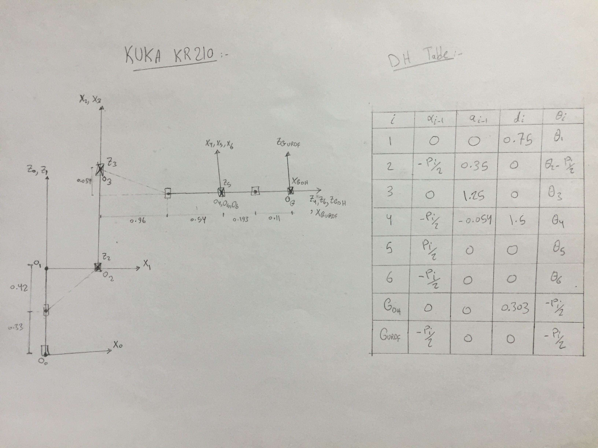
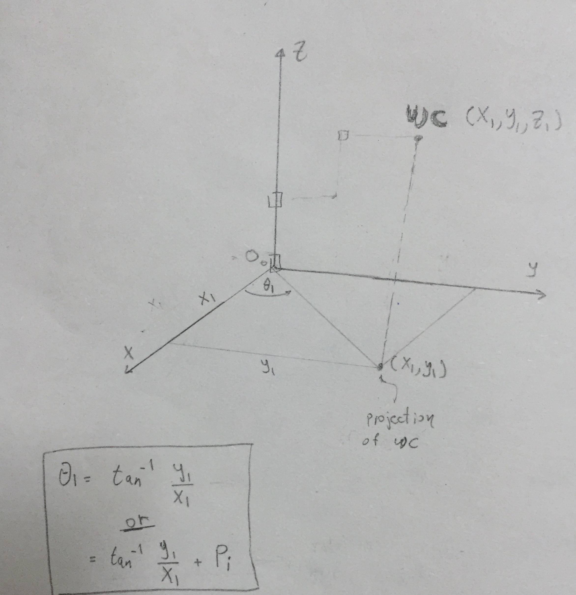
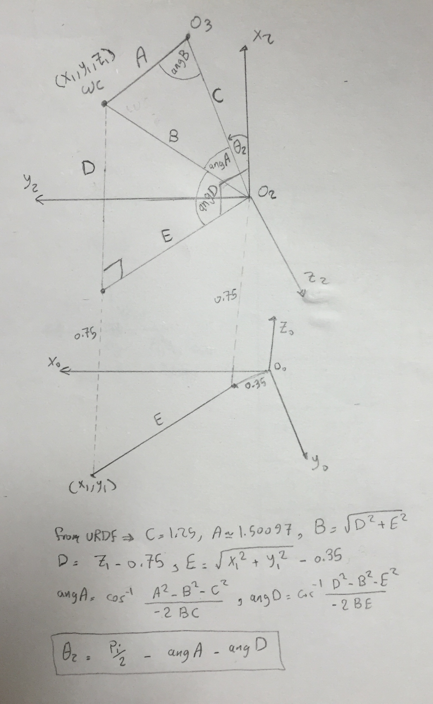
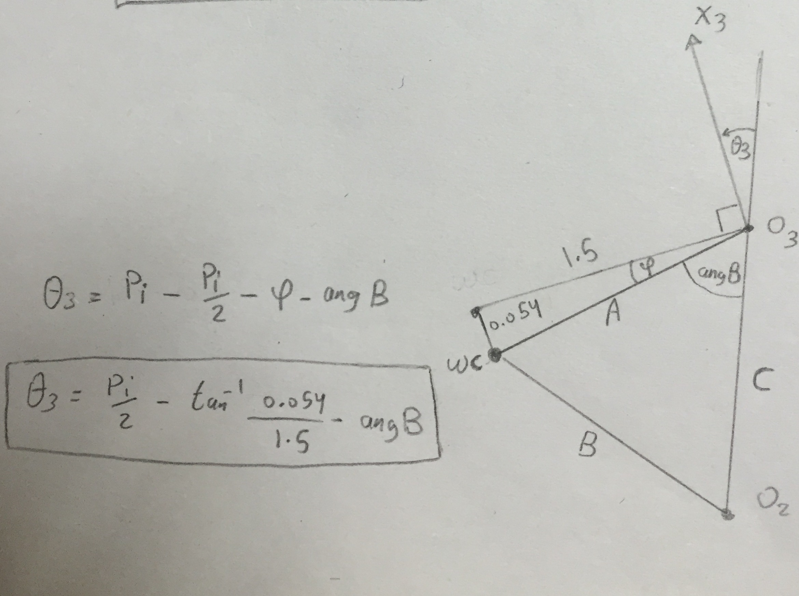
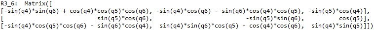
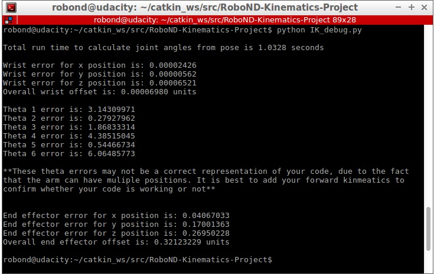
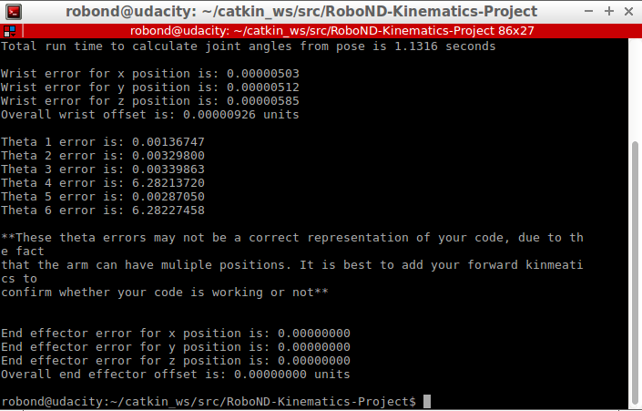

# Project Writeup: Kinematics Pick & Place

## Kinematic Analysis
### 1. Forward kinematics and DH parameters.

Deriving the DH parameters for Kuka KR210 was done as illustrated in the [KR210 Forward Kinematics section](https://classroom.udacity.com/nanodegrees/nd209/parts/7b2fd2d7-e181-401e-977a-6158c77bf816/modules/8855de3f-2897-46c3-a805-628b5ecf045b/lessons/91d017b1-4493-4522-ad52-04a74a01094c/concepts/398f60b1-b112-41ec-b8bc-59e95a2cec70). However, I adopted another technique to convert the Gribber frame from DH convention to URDF convention. I assumed there are two frames: `Gdh` represents the Gribber in DH convention and `Gurdf` represents the Gribber frame in URDF convention. the figure below shows the robot frames from frame `0` to frame `Gurdf` and the corresponding DH table.



### 2. Transformation matrices between base frame and gripper frame .

Creating the homogenous transformation matrices was done using `sympy`. First, I have created symbols to represent the derived DH parmeters. I have also created a homogenous transformation matrix `Tdh` and substituted with the DH parameters from the `DHTable` dictionary to create the transformation matrices between each two consecutive frames. Then, by multiplying these transformation matrices we get the transformation matrix between base frame and gribber frame i.e the transformation between frame 0 and frame Gurdf. the next block of code shows the implementation of this step.

```
# Create symbols
q, d, a, alpha = symbols("q d a alpha") # used for the generalized Modified DH Transformation matrix Tdh
q1, q2, q3, q4, q5, q6, q7, q8 = symbols('q1:9')
d1, d2, d3, d4, d5, d6, d7, d8 = symbols('d1:9')
a0, a1, a2, a3, a4, a5, a6, a7 = symbols('a0:8')
alpha0, alpha1, alpha2, alpha3, alpha4, alpha5, alpha6, alpha7 = symbols('alpha0:8')

# Create Modified DH parameters
DHTable = { alpha0:     0, a0:      0, d1:  0.75, 
            alpha1: -pi/2, a1:   0.35, d2:     0, q2: q2-pi/2,
            alpha2:     0, a2:   1.25, d3:     0,
            alpha3: -pi/2, a3: -0.054, d4:   1.5,
            alpha4:  pi/2, a4:      0, d5:     0,
            alpha5: -pi/2, a5:      0, d6:     0,
            alpha6:     0, a6:      0, d7: 0.303, q7: -pi/2,
            alpha7: -pi/2, a7:      0, d8:     0, q8: -pi/2 }	

# Define Modified DH Transformation matrix
Tdh = Matrix([ 	[ 	     cos(q), 	       -sin(q),		  0,		 a],
[ sin(q)*cos(alpha), cos(q)*cos(alpha),	-sin(alpha), -sin(alpha)*d],
[ sin(q)*sin(alpha), cos(q)*sin(alpha),	 cos(alpha),  cos(alpha)*d],
[                 0,                 0,           0,             1]	])

# Create individual transformation matrices
T0_1 = Tdh.subs([(q, q1), (d, d1), (a,a0), (alpha, alpha0)])
T0_1 = T0_1.subs(DHTable)
T1_2 = Tdh.subs([(q, q2), (d, d2), (a,a1), (alpha, alpha1)])
T1_2 = T1_2.subs(DHTable)
T2_3 = Tdh.subs([(q, q3), (d, d3), (a,a2), (alpha, alpha2)])
T2_3 = T2_3.subs(DHTable)
T3_4 = Tdh.subs([(q, q4), (d, d4), (a,a3), (alpha, alpha3)])
T3_4 = T3_4.subs(DHTable)
T4_5 = Tdh.subs([(q, q5), (d, d5), (a,a4), (alpha, alpha4)])
T4_5 = T4_5.subs(DHTable)
T5_6 = Tdh.subs([(q, q6), (d, d6), (a,a5), (alpha, alpha5)])
T5_6 = T5_6.subs(DHTable)
T6_Gdh = Tdh.subs([(q, q7), (d, d7), (a,a6), (alpha, alpha6)])
T6_Gdh = T6_Gdh.subs(DHTable)
TGdh_Gurdf = Tdh.subs([(q, q8), (d, d8), (a,a7), (alpha, alpha7)])
TGdh_Gurdf = TGdh_Gurdf.subs(DHTable)

T0_2 = T0_1 * T1_2
T0_3 = T0_2 * T2_3
T0_4 = T0_3 * T3_4
T0_5 = T0_4 * T4_5
T0_6 = T0_5 * T5_6
T0_Gdh = T0_6 * T6_Gdh
T0_Gurdf = T0_Gdh * TGdh_Gurdf
```

### 3. Inverse Kinematics.

The first step in solving the Inverse Position Kinematics was getting the wrist center position. This simple algorithm shows how to achieve this.
```
## steps to get the WC position w.r.t base frame
# given EE pose => quaternion and EE Position w.r.t base frame
# from quaternion get euler angles
# from euler angles get rotation matix R0_Gurdftc
# from R0_Gurdf and EE Position get Transformation matrix T0_Gurdftc
# from T0_Gurdftc and T6_Gurdf get T0_6
# from T0_6 get Position of WC w.r.t base frame
```

The figures below show how to derive the equations used for obtaining the first three joint angles.

#### theta1

--------------

#### theta2

--------------

#### theta3

-------------

Deriving the equations for the last three joint angles, or the Inverse Orientation Kinematics, was so much easier to me. The [Inverse Kinematics with Kuka KR210](https://classroom.udacity.com/nanodegrees/nd209/parts/7b2fd2d7-e181-401e-977a-6158c77bf816/modules/8855de3f-2897-46c3-a805-628b5ecf045b/lessons/91d017b1-4493-4522-ad52-04a74a01094c/concepts/a1abb738-84ee-48b1-82d7-ace881b5aec0) section shows that given the first three joint angles and the end effector pose, we can get the values of the Rotation Matrix between frame 3 and frame 6.
```
R0_3tc = T0_3[0:3, 0:3]
R0_3tc = R0_3tc.evalf(subs={q1: theta1, q2:theta2, q3:theta3})
R3_6tc = R0_3tc.inv("LU") * T0_6tc[0:3,0:3]
```
Additionally we can also get the same Rotation Matrix between frame 3 and frame 6 as a function of theta4, theta5 and theta6 from the Modified DH Transformation matrices using the next line of code.
```
R3_6 = T3_4[0:3,0:3] * T4_5[0:3,0:3] * T5_6[0:3,0:3]
```


--------------
The next block of code shows how to get the last three joint angles from the values of `R3_6tc` using the equations of `R3_6`.
```
theta4 = atan2(R3_6tc[2,2], -R3_6tc[0,2])
theta5 = atan2(sqrt( R3_6tc[0,2]**2 + R3_6tc[2,2]**2 ), R3_6tc[1,2])
theta6 = atan2(-R3_6tc[1,1], R3_6tc[1,0])
```


## Project Implementation

### 1. `IK_server.py` file.


The main parts of the code was covered and illustrated above in the Kinematic Analysis section.

The next figures show the output of IK_debug.py with the test case 3 which is provided in the script. The overall error seems pretty good as I get zero error with some test cases.



This video  shows a complete pick and place cycle. Note that I have speeded up the video 4 times just to save the time.
